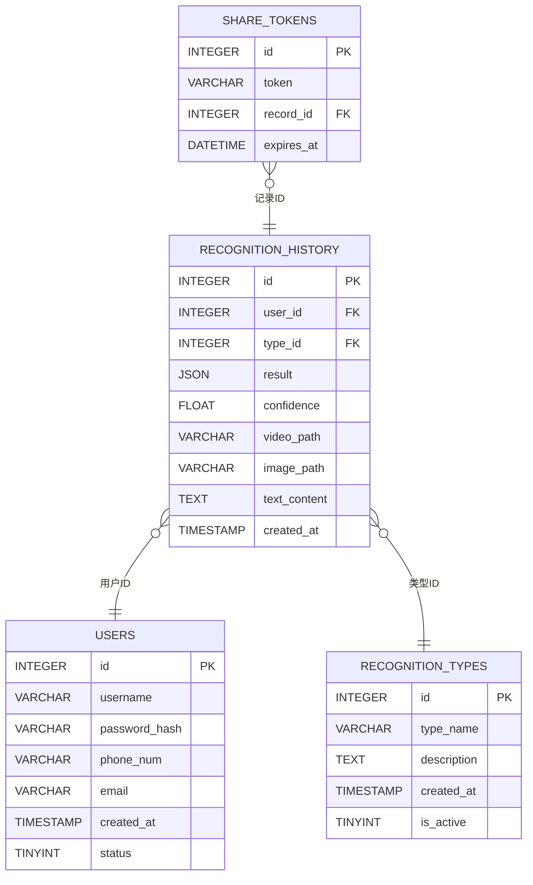

# 情感识别数据库文档

## 概述
- [简介](#简介)
- [数据库类型](#数据库类型)
- [表结构](#表结构)
    - [用户表（USERS）](#用户表users)
    - [识别类型表（RECOGNITION_TYPES）](#识别类型表recognition_types)
    - [识别历史表（RECOGNITION_HISTORY）](#识别历史表recognition_history)
    - [分享令牌表（SHARE_TOKENS）](#分享令牌表share_tokens)
- [表关系](#表关系)
- [数据库关系图](#数据库关系图)

## 简介
本数据库主要用于存储情感识别相关的数据，包括用户信息、识别类型、识别历史记录以及分享令牌。

## 数据库类型
- **数据库系统**：MySQL

## 表结构

### 用户表（USERS）
该表用于存储系统用户的基本信息。
| 字段名 | 数据类型 | 设置 | 引用 | 备注 |
| ---- | ---- | ---- | ---- | ---- |
| **id** | INTEGER | 🔑 主键，可为空，自动递增 |  | 用户ID |
| **username** | VARCHAR(50) | 非空，唯一 |  | 用户登录名（唯一） |
| **password_hash** | VARCHAR(255) | 非空 |  | BCrypt加密后的密码 |
| **phone_num** | VARCHAR(100) | 可为空，唯一 |  | 手机号（唯一） |
| **email** | VARCHAR(100) | 可为空，唯一 |  | 邮箱地址（唯一） |
| **created_at** | TIMESTAMP | 可为空，默认值：CURRENT_TIMESTAMP |  | 账户创建时间 |
| **status** | TINYINT | 可为空，默认值：1 |  | 用户状态：1 - 正常，0 - 禁用 |

#### 索引
| 索引名 | 是否唯一 | 字段 |
| ---- | ---- | ---- |
| idx_users_username | 是（username列有UNIQUE约束） | username |
| idx_users_phone | 否（phone_num列有UNIQUE约束） | phone_num |
| idx_users_email | 否（email列有UNIQUE约束） | email |

### 识别类型表（RECOGNITION_TYPES）
该表用于存储不同的情感识别类型信息。
| 字段名 | 数据类型 | 设置 | 引用 | 备注 |
| ---- | ---- | ---- | ---- | ---- |
| **id** | INTEGER | 🔑 主键，可为空，自动递增 |  | 类型ID |
| **type_name** | VARCHAR(50) | 非空，唯一 |  | 识别类型名称 |
| **description** | TEXT(65535) | 可为空，默认值：NULL |  | 类型描述 |
| **created_at** | TIMESTAMP | 可为空，默认值：CURRENT_TIMESTAMP |  | 创建时间 |
| **is_active** | TINYINT | 可为空，默认值：1 |  | 是否启用：1 - 是，0 - 否 |

### 识别历史表（RECOGNITION_HISTORY）
该表用于记录每个用户的情感识别历史信息。
| 字段名 | 数据类型 | 设置 | 引用 | 备注 |
| ---- | ---- | ---- | ---- | ---- |
| **id** | INTEGER | 🔑 主键，可为空，自动递增 |  | 记录ID |
| **user_id** | INTEGER | 非空 | fk_RECOGNITION_HISTORY_user_id_USERS | 用户ID（外键） |
| **type_id** | INTEGER | 非空 | fk_RECOGNITION_HISTORY_type_id_RECOGNITION_TYPES | 识别类型ID（外键） |
| **result** | JSON | 非空 |  | 识别结果JSON对象 |
| **confidence** | FLOAT(4,2) | 非空 |  | 置信度（0 - 1） |
| **video_path** | VARCHAR(255) | 可为空，默认值：NULL |  | 视频存储路径 |
| **image_path** | VARCHAR(255) | 可为空，默认值：NULL |  | 图像存储路径 |
| **text_content** | TEXT(65535) | 可为空，默认值：NULL |  | 识别文本内容 |
| **created_at** | TIMESTAMP | 可为空，默认值：CURRENT_TIMESTAMP |  | 识别时间 |

#### 索引
| 索引名 | 是否唯一 | 字段 |
| ---- | ---- | ---- |
| idx_history_user_time | 否 | user_id, created_at |
| idx_history_type | 否 | type_id |
| idx_history_time | 否 | created_at |

### 分享令牌表（SHARE_TOKENS）
该表用于存储生成的分享令牌及其关联信息，支持限时分享功能。
| 字段名 | 数据类型 | 设置 | 引用 | 备注 |
| ---- | ---- | ---- | ---- | ---- |
| **id** | INTEGER | 🔑 主键，可为空，自动递增 |  | 令牌ID |
| **token** | VARCHAR(64) | 非空，唯一 |  | 分享令牌（UUID生成的唯一字符串） |
| **record_id** | INTEGER | 非空 | fk_SHARE_TOKENS_record_id_RECOGNITION_HISTORY | 关联的识别记录ID |
| **expires_at** | DATETIME | 非空 |  | 令牌过期时间 |

#### 索引
| 索引名 | 是否唯一 | 字段 |
| ---- | ---- | ---- |
| idx_token | 是 | token |
| idx_expires_at | 否 | expires_at |
| idx_record_id | 否 | record_id |

## 表关系
- **识别历史表（RECOGNITION_HISTORY）与用户表（USERS）**：多对一关系
- **识别历史表（RECOGNITION_HISTORY）与识别类型表（RECOGNITION_TYPES）**：多对一关系
- **分享令牌表（SHARE_TOKENS）与识别历史表（RECOGNITION_HISTORY）**：多对一关系

## 数据库关系图

