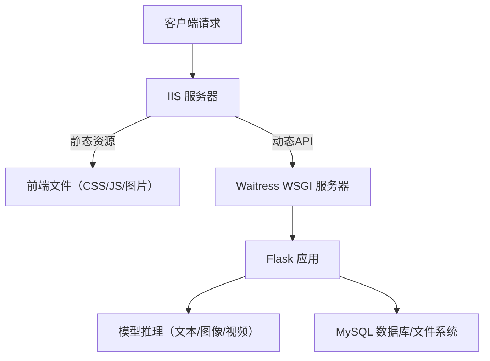

# 技术框架说明文档

## 一、系统概述
本系统是基于深度学习的多模态情绪识别平台，支持文本、图像、视频三种输入类型，可精准识别愤怒、厌恶、恐惧、喜悦、中性、悲伤、惊讶7类基础情绪。系统采用分层架构设计，通过模块化拆分实现功能解耦，确保扩展性与可维护性。

## 二、整体架构
系统采用四层递进式架构，各层通过标准化接口实现数据交互，架构图如下：

```
┌─────────────────────────────────────────────────────────────┐
│ 前端层 (用户交互与可视化)                                   │
│  ┌──────────┬──────────┬──────────┬──────────┬──────────┐   │
│  │ 识别页面 │ 历史记录 │ 数据看板 │ 用户中心 │ 分享页面 │   │
│  └──────────┴──────────┴──────────┴──────────┴──────────┘   │
└───────────────────────────────┬─────────────────────────────┘
                                │ HTTP/HTTPS
┌───────────────────────────────▼─────────────────────────────┐
│ 后端API层 (业务逻辑与权限控制)                              │
│  ┌──────────┬──────────┬──────────┬──────────┬──────────┐   │
│  │ 用户认证 │ 情绪识别 │ 记录管理 │ 数据统计 │ 分享管理 │   │
│  └──────────┴──────────┴──────────┴──────────┴──────────┘   │
└───────────────────────────────┬─────────────────────────────┘
                                │ 函数调用/数据传递
┌───────────────────────────────▼─────────────────────────────┐
│ 模型层 (情绪分析核心算法)                                    │
│  ┌────────────────┬────────────────────────────────────┐   │
│  │ 文本分析模块   │ 图像/视频分析模块                   │   │
│  │ (BERT模型)     │ (dlib+LightGBM模型)                │   │
│  └────────────────┴────────────────────────────────────┘   │
└───────────────────────────────┬─────────────────────────────┘
                                │ 数据持久化操作
┌───────────────────────────────▼─────────────────────────────┐
│ 数据存储层 (信息与文件管理)                                  │
│  ┌──────────┬─────────────┬─────────────┬──────────────┐    │
│  │ 用户表   │ 识别记录表  │ 分享令牌表  │ 文件存储系统 │    │
│  └──────────┴─────────────┴─────────────┴──────────────┘    │
└─────────────────────────────────────────────────────────────┘
```

### 2.1 各层核心功能
1. **前端层**
   - 基于响应式设计，适配PC与移动设备
   - 通过ECharts实现情绪分布、趋势等数据可视化
   - 提供模块化交互界面（识别、历史、分析、用户中心）

2. **后端API层**
   - 基于Flask构建RESTful API，处理HTTP请求
   - 实现用户认证、权限控制与业务逻辑
   - 协调模型层与数据存储层的数据交互

3. **模型层**
   - 文本情绪分析：基于BERT预训练模型实现中文语义理解
   - 图像/视频分析：通过dlib提取68点人脸关键点，结合LightGBM模型分类

4. **数据存储层**
   - MySQL存储结构化数据（用户信息、识别记录等）
   - 文件系统存储媒体资源（图像/视频），按用户ID分区管理

## 三、核心技术栈

### 3.1 后端技术栈
| 技术组件         | 版本       | 核心作用                          |
|------------------|------------|-----------------------------------|
| Flask            | 2.0.1      | Web应用框架，构建API服务          |
| pymysql         | 1.1.0      | MySQL数据库驱动                   |
| MySQL            | 8.0+       | 关系型数据库，存储结构化数据      |
| bcrypt           | 4.0.0+     | 密码加密存储（BCrypt算法）        |
| LightGBM         | 4.6.0      | 图像/视频情绪分类模型            |
| dlib             | 19.24.1    | 人脸检测与68点关键点提取          |
| OpenCV           | 4.8.0      | 图像/视频帧处理                  |
| Transformers     | 4.30.2     | BERT模型加载与文本特征提取        |
| PyTorch          | 2.2.2+cu121| 深度学习框架，支持GPU加速         |

### 3.2 前端技术栈
| 技术组件       | 版本       | 核心作用                          |
|----------------|------------|-----------------------------------|
| HTML5/CSS3     | -          | 页面结构与样式设计                |
| JavaScript     | ES6+       | 交互逻辑与API请求                 |
| Font Awesome   | 6.4.0      | 功能图标库（导航、按钮等）        |
| ECharts        | 5.4.3      | 数据可视化（柱状图、散点图等）    |

## 四、核心数据流程

### 4.1 情绪识别流程
1. **请求发起**
   - 文本：用户输入文本 → 前端校验长度（≤100字）→ 提交至`/api/text/analyze`
   - 图像：上传图片 → 前端格式校验 → 提交至`/api/image/analyze`
   - 视频：摄像头授权 → 选择分辨率 → 录制视频上传至`/api/video/upload`处理

2. **后端处理**
   - 权限验证：检查用户会话有效性
   - 数据预处理：文本分词/图像格式转换/视频帧提取
   - 模型调用：根据类型分发至对应分析模块

3. **模型推理**
   - 文本：BERT模型生成情绪概率分布 → 取最高置信度结果
   - 图像/视频：
     - dlib检测人脸并提取68点关键点
     - 计算几何特征（点距、区域比例等）
     - LightGBM模型分类并生成情绪标签

4. **结果返回**
   - 封装JSON结果（情绪类别、置信度、特征数据）
   - 前端渲染展示（标签、进度条、可视化图表）

### 4.2 数据存储流程
1. **结构化数据**
   - 识别记录存入`RECOGNITION_HISTORY`表，包含：
     - 用户ID、识别类型、情绪结果（JSON）
     - 媒体文件路径、置信度、时间戳
   - 关联`USERS`表实现用户数据隔离

2. **媒体文件**
   - 存储路径：`p3_resources/{用户名}/{类型}s/`
   - 命名规则：`{用户ID}_{时间戳}.{扩展名}`
   - 处理后文件附加`_r`标识（如原始图与标注图）

## 五、模型实现细节

### 5.1 文本情绪分析模型
- **基础模型**：`nlp_structbert_emotion_classification_chinese_base`
- **预处理**：
  - 文本截断（max_length=128）
  - Tokenizer编码为词向量
- **推理流程**：
  ```mermaid
  graph LR
  A[输入文本] --> B[分词与编码]
  B --> C[BERT特征提取]
  C --> D[全连接层分类]
  D --> E[softmax概率分布]
  E --> F[输出主情绪与置信度]
  ```

### 5.2 图像/视频情绪分析模型
- **人脸检测**：dlib的HOG+SVM算法，支持多脸检测
- **特征提取**：
  - 全局特征：68点关键点间欧氏距离（2278维）
  - 区域特征：眼高宽比、嘴部开合度等（8维）
  - 对称性特征：左右脸特征差值（2维）
- **分类模型**：
  - LightGBM梯度提升树
  - 5折交叉验证，特征筛选后保留500维关键特征
- **视频优化**：
  - 跳帧处理（默认间隔10帧，VideoProcessor默认5帧）

## 六、安全与性能优化

### 6.1 安全机制
- **用户认证**：
  - 基于Session的身份验证
  - 密码BCrypt加密存储，禁止明文传输
- **数据防护**：
  - SQL参数化查询，防止注入攻击
  - 媒体文件类型/大小校验，防范恶意文件
  - 分享令牌（UUID）有效期1小时，自动清理过期数据
- **传输安全**：
  - 生产环境启用HTTPS加密

### 6.2 性能优化
- **后端优化**：
  - 数据库索引优化（用户ID、时间戳字段）
- **前端优化**：
  - 图表懒加载与分页加载
- **存储优化**：
  - 媒体文件按用户分区，提升查询效率
  - 定期清理冗余临时文件

## 七、部署架构（生产环境适配版）  

### 7.2 生产环境（Windows Server 2022 专属方案）  
#### 7.2.1 服务器规格（基于实际云资源）  
| 维度         | 配置详情                                                                 |  
|--------------|--------------------------------------------------------------------------|  
| **云服务商** | 阿里云                                                                    |  
| **地域**     | 华东1（杭州）                                                             |  
| **实例规格** | ecs.u1-cm2.xlarge（4核 vCPU + 8 GiB 内存）                                |  
| **存储**     | 40 GiB ESSD Entry 云盘（系统盘，建议额外挂载数据盘存储媒体文件）          |  
| **网络**     | 100 Mbps 峰值带宽（按使用流量计费），公网IP `120.27.129.102`（弹性绑定）  |  
| **操作系统** | Windows Server 2022 数据中心版 64位中文版                                 |  


#### 7.2.2 部署架构（Windows 原生方案）  
采用 **IIS + Waitress** 架构，贴合Windows Server生态：  



### 核心组件部署说明  
#### 1. **IIS（Web 服务器）**  
- **职责**：  
  - 托管前端静态资源（`p2_web_frontend/static` 目录）；  
  - 作为反向代理，将 `/api/*` 请求转发至 Waitress 服务（默认 `http://127.0.0.1:8000`）；  
  - 支持 HTTPS 证书配置（需申请阿里云SSL证书并绑定域名）。  

- **部署步骤**：  
  1. 打开 **服务器管理器** → 安装 **Web 服务器（IIS）** 角色；  
  2. 安装扩展：**URL 重写模块** + **应用请求路由（ARR）**（用于反向代理）；  
  3. 新建站点，绑定公网IP和端口（80/443），配置静态文件路径为 `C:\emotion_service\p2_web_frontend`；  
  4. 配置反向代理规则（通过 ARR）：将 `/api` 前缀请求转发至 `http://127.0.0.1:8000`。  


#### 2. **Waitress（WSGI 服务器）**  
- **职责**：纯Python实现，稳定托管Flask应用，适配Windows环境。  
- **部署步骤**：  
  1. 在项目目录创建虚拟环境：  
     ```powershell
     python -m venv emotion_venv
     .\emotion_venv\Scripts\activate
     ```  
  2. 安装依赖（注意Windows专属适配）：  
     ```powershell
     pip install flask pymysql bcrypt lightgbm dlib opencv-python torch torchvision torchaudio transformers waitress
     ```  
     *注：`dlib` 需安装预编译包（如 `dlib-19.24.0-cp311-cp311-win_amd64.whl`），避免手动编译。*  
  3. 编写启动脚本 `run_server.ps1`：  
     ```powershell
     # 激活虚拟环境并启动Waitress
     .\emotion_venv\Scripts\activate
     waitress-serve --host 127.0.0.1 --port 8000 --threads 4 app:app
     ```  
  4. 配置自动启动：  
     - 通过 **任务计划程序** 设置“系统启动时”执行 `run_server.ps1`；  
     - 或封装为 **Windows服务**（推荐工具：`nssm.exe`）。  


#### 3. **模型与数据适配**  
- **模型路径**：  
  - 文本模型（BERT）：默认存储在用户目录 `.cache\huggingface\`，需确保服务账户有权限访问；  
  - 图像模型（LightGBM）：将 `.txt` 模型文件放置在 `p1_models_train\LightGBM\`，代码中用绝对路径加载（如 `C:\emotion_service\p1_models_train\LightGBM\model.txt`）。  

- **媒体存储**：  
  - 建议挂载额外数据盘（如 `D:\emotion_resources\`），避免占用系统盘；  
  - 代码中统一用 `os.path.join()` 处理路径（适配Windows反斜杠）。  


#### 7.2.3 监控与运维（云原生方案）  
利用 **阿里云生态工具** 实现无侵入式管理：  
1. **基础监控**：  
   - 云服务器自动采集CPU、内存、网络流量等指标，通过 **阿里云控制台** 实时查看；  
   - 配置告警规则（如CPU≥80%持续5分钟 → 邮件/短信通知）。  

2. **应用日志**：  
   - 在Flask中启用请求日志（记录API耗时、状态码），输出至 `C:\emotion_service\logs\`；  
   - 通过 **阿里云日志服务（SLS）** 采集日志，配置实时分析（如慢请求追踪）。  

3. **数据备份**：  
   - 数据库（若使用MySQL，建议部署 **阿里云RDS**）：开启每日全量备份；  
   - 媒体文件：定期同步至 **阿里云OSS**，实现异地容灾。  


#### 7.2.4 环境约束与优化  
1. **性能优化**：  
   - 限制Waitress线程数（`--threads 4`，避免4核CPU过载）；  
   - 静态资源通过IIS压缩传输（开启Gzip压缩）。  

2. **权限控制**：  
   - 确保IIS应用池账户（默认 `IIS APPPOOL\DefaultAppPool`）有权限读写 `p3_resources\` 目录；  
   - 数据库连接串使用独立账户，避免明文存储（建议通过环境变量传递）。  

3. **依赖陷阱**：  
   - **dlib**：Windows下优先使用预编译包，否则需安装CMake和Visual Studio Build Tools编译；  
   - **PyTorch**：若显卡支持，安装CUDA版本（`torch torchvision torchaudio --index-url https://download.pytorch.org/whl/cu121`）加速推理。  

## 八、项目文件结构
```
EmotionRecognitionSystem/
├── p0_MySQL/               # 数据库模块
│   ├── sql_base.py         # 数据库连接与操作
│   └── sql_model.py        # 数据模型定义
├── p1_models_train/        # 模型训练与推理
│   ├── LightGBM/           # 图像/视频模型
│   └── TextModel/          # 文本模型
├── p2_web_frontend/        # 前端资源
│   ├── static/             # 静态文件(css/js/fonts)
│   └── templates/          # HTML模板
├── p3_resources/           # 媒体资源存储
│   └── {user_id}/          # 按用户分区
└── app.py                  # 应用入口
```

**撰写人**：李正标  
**更新时间**：2025年07月16日